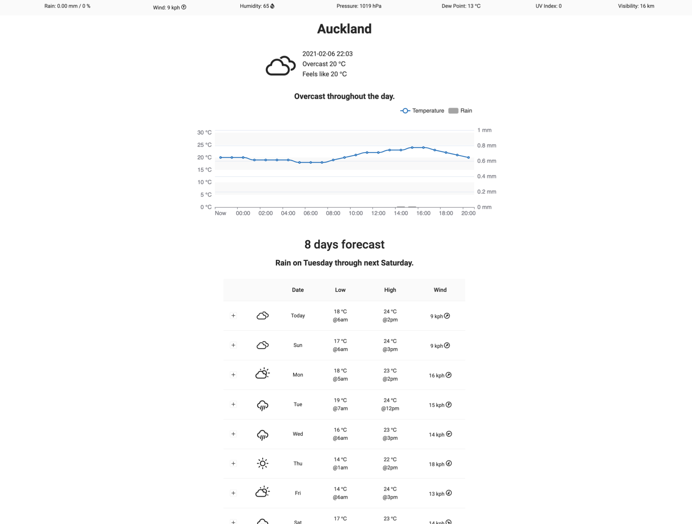

# Weather App

One of these APIs should do the job.
1- [here](https://www.metaweather.com/api/) or [here](https://weatherstack.com/documentation) or [here](https://api.windy.com/)
If you face issue fetching the data maybe [this](https://stackoverflow.com/questions/43262121/trying-to-use-fetch-and-pass-in-mode-no-cors/43268098) helps.

## Requirements
Create an application that fetches data from one of the above API. 

1- the app functionallity should look like this you are free to change design be as creative as possible .check the examples down for inspirations**
 

## Optional

1- Background image of the web page changes according to the Weather.

***PS**: You are free to use a CSS framework.*

**Those are some [images](https://static.dribbble.com/users/2158940/screenshots/7376567/media/35649246137de1ce1d3f68d4ad1e1ffa.png) for [inspiration](https://static.dribbble.com/users/2158940/screenshots/7118235/media/1ea59d43e8e99a529220bed091f8eb84.png).* 

## Coding Phase

- Use `projects` in github, they can be useful in arranging the tasks or issues with description and image so everyone knows what they should do
- to track their work its better to add columns like `in progress`, `done` , and `closed`
- minimize the communication required in Slack, try to make them depend on review comments and task descriptions
- They should create a branch locally with the naming convention `[issue id + issue title]` and then push it and submit a Pull Request that must be attached to the issue after
- Make the tasks small but more, this can reduce conflicts and won't overwhelm them, not sure if it a good idea but I’m just experiencing here so they may do more than one task a week depending on how fast they are

**Pull Requests**

- Go to the issues board and create a new issue with the task assigned to you.
- Assign the issue to yourself so others know who is working on this issue.
- Create a new pull request from that issue and also assign it to yourself, Github will automatically create a branch for you and give you instructions how to check it out.
- After finishing the work, push your code and assign the team leader on that pull request so they can review the code.
